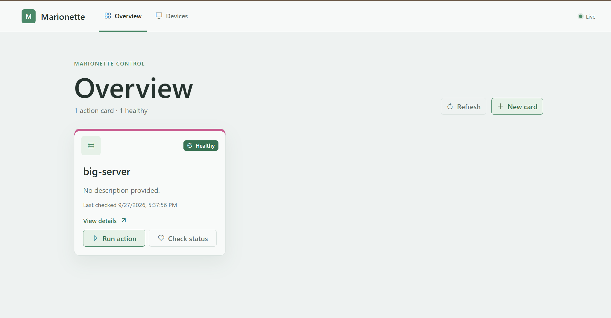

# Marionette

[](https://github.com/vnevoral/marionette/actions/workflows/ci.yml)
[](https://github.com/vnevoral/marionette/releases/latest)
[](LICENSE)

Marionette is a small self-hosted web dashboard for running predefined
commands on a Linux host and watching the result. It ships as a single
binary (Go backend with an embedded Vue 3 + PrimeVue single-page
application) that runs as a systemd service; the reference target is a
Raspberry Pi running Ubuntu (linux/arm64). Nothing else — no Node.js, no
database, no separate web server — is installed on the target.

Released versions and their notes are on
[GitHub Releases](https://github.com/vnevoral/marionette/releases). The
running version is shown in the UI footer and in `GET /api/health`.



## Features

- **Action cards.** Each card has a name, description, icon and an optional
  color stripe, a **primary action** (for example Wake-on-LAN) and an
  optional **status action** (for example `ping`) that decides whether the
  card is Healthy, Problem or Unknown.
- **Safe execution.** Actions are run directly (no shell) with a timeout,
  in their own process group, with a minimal environment and a global limit
  of concurrent actions. Success is decided by the exit code or by a
  regular expression over the output.
- **Status checks.** Status actions run on a schedule (a standard interval
  and a faster interval for a while after the primary action) or on demand.
- **Live updates.** Status changes and finished primary action runs reach
  the browser over Server-Sent Events, with REST polling as a fallback; the
  dashboard shows the outcome of each run on the card.
- **History.** The card detail lists recent primary action runs (exit code,
  duration, output), the status timeline and the output of the last status
  check.
- **Card editor.** Create, edit and delete cards in the UI; each command is
  entered as a single command line with a preview of the parsed arguments.
- **Device pairing.** Only paired browsers can use the API; a device pairs
  once with a one-time code and can be renamed or removed on the Devices
  page. There are no passwords.
- **Single JSON file.** Cards, settings and run history live in one
  configuration file; a corrupted file is quarantined, never overwritten.
- **Responsive and accessible UI** from 320 px wide, usable with a keyboard
  and on touch screens.

## Layout

- `cmd/marionette` — application entrypoint (composition, logging, lifecycle)
- `internal/server` — HTTP layer (API routes, SSE, SPA fallback)
- `internal/access` — paired devices, pairing codes and device tokens
- `internal/config` — card domain model, in-memory store, JSON persistence
- `internal/execengine` — action execution (process groups, timeouts, minimal environment)
- `internal/status` — status checks and polling scheduler
- `internal/actions` — background action queue
- `internal/events` — event broker feeding SSE (status changes, recorded runs)
- `internal/fsutil` — atomic file writes
- `internal/webui` — embeds `web/dist` (the built SPA) into the Go binary via `go:embed`
- `web` — Vue 3 + PrimeVue SPA source (built with Vite)

## Development

Open the folder in the dev container (VS Code: "Reopen in Container"), then:

```bash
make ui-install   # once, installs npm dependencies
make ui-dev       # Vite dev server on :5173, proxies /api to :8080
make backend-dev  # Go backend with hot reload (air) on :8080
make verify       # build UI + lint + tests; run before every commit
make e2e          # browser tests against the built binary (Playwright, Chromium)
```

The backend reads `./marionette.json`, which is git-ignored and created from
`deploy/dev-fixture.json` on the first `make backend-dev` (or `make
dev-config`). Go 1.23 or newer (`go.mod`) and Node 22 (`web/.nvmrc`) are
required; the dev container provides both.

Access control is on in development too: the first start prints a pairing
code in the backend output; enter it on the pairing screen once (the paired
device is kept in `./devices.json`). Set `MARIONETTE_AUTH=off` to skip
pairing while developing.

## Production build

```bash
make build          # builds UI, embeds it, builds a binary for the host platform
make build-arm64    # cross-compiles for Raspberry Pi (Ubuntu, linux/arm64)
make release-arm64  # release archive + .sha256 from a clean, tagged commit
```

The resulting binary in `bin/` serves the UI and API from a single process —
no separate web server or Node runtime is needed on the Raspberry Pi. The
build stamps the version from `git describe` into the binary (override with
`make build VERSION=…`); `GET /api/health` reports it together with the
uptime in seconds.

## Installation on Linux with systemd

Releases are versioned `vMAJOR.MINOR.PATCH` by git tags (rules in
[docs/devops/ci-cd.md](docs/devops/ci-cd.md)). Pushing such a tag runs the
full CI and then publishes a
[GitHub Release](https://github.com/vnevoral/marionette/releases) with the
ARM64 archive and its `.sha256` file.

Download both on the target Linux host. The commands below use the shell
variable `v` for the release tag; set it to the version you install (the
[latest release](https://github.com/vnevoral/marionette/releases/latest)
unless you have a reason to pick another):

```bash
v=vX.Y.Z   # the release to install
base=https://github.com/vnevoral/marionette/releases/download/$v
curl -LO "$base/marionette-$v-linux-arm64.tar.gz"
curl -LO "$base/marionette-$v-linux-arm64.tar.gz.sha256"
```

With the GitHub CLI, `gh release download "$v" -R vnevoral/marionette -p
"marionette-$v-linux-arm64.tar.gz*"` does the same.

Without GitHub, build the same archive on a build host from a clean, tagged
commit and copy both files over; without a matching tag on `HEAD`, or with
uncommitted changes, the target fails and explains how to tag:

```bash
git tag -a "$v" -m "Marionette $v"
make release-arm64      # bin/marionette-$v-linux-arm64.tar.gz + .sha256
```

Verify and extract the archive on the target host (with `v` set to the
same tag), and run the installer as root:

```bash
sha256sum -c "marionette-$v-linux-arm64.tar.gz.sha256"
tar -xzf "marionette-$v-linux-arm64.tar.gz"
sudo ./install.sh ./marionette-linux-arm64
curl -s http://localhost:8080/api/health   # "version" reports the tag
```

The installer creates the `marionette` service account, preserves an existing
`/var/lib/marionette/marionette.json`, installs the unit, and starts the
service. On a host without paired devices it ends with the command that shows
the first pairing code (see [Pairing devices](#pairing-devices)). If the
kernel does not allow unprivileged ping for the service account, it also prints
the fix (see [Ping status check reports Problem](#ping-status-check-reports-problem)). Runtime settings are read from `/etc/default/marionette`:

| Variable                      | Default             | Meaning                                                                                                   |
| ----------------------------- | ------------------- | --------------------------------------------------------------------------------------------------------- |
| `MARIONETTE_CONFIG`           | `./marionette.json` | Path of the configuration file (cards, settings, saved history).                                          |
| `MARIONETTE_ADDR`             | `:8080`             | HTTP listen address.                                                                                      |
| `MARIONETTE_SHUTDOWN_TIMEOUT` | `20s`               | Total budget for a graceful stop (Go duration). Keep it below the unit's `TimeoutStopSec` (90 s default). |
| `MARIONETTE_ALLOWED_HOSTS`    | empty               | Comma-separated hosts (optionally `host:port`; 80/443 equal no port) accepted for mutating API requests; empty accepts any host. |
| `MARIONETTE_LOG_FORMAT`       | `text`              | `text` (journald friendly) or `json` structured logs.                                                     |
| `MARIONETTE_LOG_LEVEL`        | `info`              | Minimum log level: `debug`, `info`, `warn` or `error`.                                                    |
| `MARIONETTE_AUTH`             | `on`                | `on` requires paired devices; `off` leaves the API open (development only, logged as a warning).          |
| `MARIONETTE_DEVICES`          | next to the config  | Path of the paired devices file (`devices.json` in the directory of `MARIONETTE_CONFIG`).                 |
| `MARIONETTE_DEVICE_EXPIRY_DAYS` | `60`              | A device unused for this many days must pair again (1–400). Devices in use are renewed automatically.     |
| `MARIONETTE_COOKIE_SECURE`    | `auto`              | `Secure` attribute of the device cookie: `auto` (when the connection uses TLS), `always` (behind a TLS proxy) or `never`. |

Cards are normally managed in the UI. The configuration file is plain
JSON; [deploy/marionette.example.json](deploy/marionette.example.json) is an
empty starting point and [deploy/dev-fixture.json](deploy/dev-fixture.json)
shows complete cards (primary and status actions, output rules, polling
intervals, color).

Global settings (`historySize`, `maxConcurrentActions`) live in the
`settings` object of the configuration file. There is no API for them: edit
the file and restart the service for a change to take effect.

Actions do not inherit the service environment. Each process gets only
`PATH`, `HOME`, `LANG` and `TZ` from the service plus the variables defined
on the action itself, so secrets in `/etc/default/marionette` never reach
user-configured commands.

On `SIGTERM`/`SIGINT` Marionette stops accepting requests, closes the live
status streams, saves the configuration and run history, discards queued
actions, lets running actions finish within the remaining budget (minus a
3 s reserve for terminating them), stops the status scheduler and saves the
history again if it changed. A second signal terminates the process at once.

Mutating API requests (creating, editing, deleting or running cards) are
protected against cross-site requests from other websites open in the
operator's browser: they must use `Content-Type: application/json`, and a
browser-supplied `Origin` or `Sec-Fetch-Site: cross-site` that does not match
the server is rejected with 403. Hosts are compared without regard to the
default ports 80 and 443, so the check also works behind a TLS-terminating
reverse proxy.

### Pairing devices

Only paired devices (browsers) can use Marionette. A device pairs once with a
one-time code and is never asked again; there is no password.

1. **First device.** After installation, open Marionette in a browser. It
   shows the pairing screen. Read the code from the service log on the host
   and enter it with a name for the device:

   ```bash
   journalctl -u marionette | grep "pairing code"
   ```

   The code is valid for 10 minutes; opening the pairing screen again writes
   a fresh one while no device is paired.
2. **More devices.** On a paired device open **Devices** → **Pair a new
   device** and enter the shown code (or open the link) on the new device.
   Any device can be renamed later on the Devices page (pencil icon), for
   example to tell two "Chrome on Linux" apart.
3. **Removing a device** on the Devices page ends its access at once.
   A device that is not used for `MARIONETTE_DEVICE_EXPIRY_DAYS` (60 by
   default) expires; a device in use is renewed automatically.
4. **Lost every device?** On the host:

   ```bash
   sudo rm /var/lib/marionette/devices.json
   sudo systemctl restart marionette
   ```

   A new pairing code appears in the log.

The device token lives in an `HttpOnly` cookie and is stored on the host only
as a hash in `devices.json`; back that file up together with
`marionette.json`. Over plain HTTP the token travels unencrypted: use the
service inside a VPN, or put a TLS reverse proxy in front and set
`MARIONETTE_COOKIE_SECURE=always`. The API requires a paired browser; `curl`
without the cookie only reaches `/api/health`.

If the configuration file cannot be parsed at startup, Marionette moves it to
`marionette.json.corrupt-<timestamp>` (logged as a warning), starts with an
empty configuration and never overwrites the original. Fix the quarantined
file and move it back to restore the cards. If the file exists but is not
readable, the service starts read-only and rejects configuration changes
until the permissions are fixed and the service is restarted.

### Upgrading and rolling back

An upgrade is the same installer run with the new release. It keeps the data
and settings and only replaces the program and the unit:

| Path                                      | On upgrade                                  |
| ----------------------------------------- | ------------------------------------------- |
| `/var/lib/marionette/marionette.json`     | kept (cards, settings, run history)         |
| `/var/lib/marionette/devices.json`        | kept (paired devices stay paired)           |
| `/etc/default/marionette`                 | kept (created only when missing)            |
| `/usr/local/bin/marionette`               | replaced by the new version                 |
| `/etc/systemd/system/marionette.service`  | replaced by the unit from the release       |

Put your own unit changes in a drop-in (`sudo systemctl edit marionette`),
not in the unit file itself, so an upgrade does not discard them.

**Upgrade.** Keep each release in its own directory; the previous one is
what you roll back to (older releases stay downloadable from GitHub
Releases). On the host, next to the new archive and its `.sha256` file
(downloaded as above, with `v` set to the new tag):

```bash
sudo cp -a /var/lib/marionette /var/lib/marionette.bak-$(date +%F)   # backup
sha256sum -c "marionette-$v-linux-arm64.tar.gz.sha256"
mkdir "$v" && tar -xzf "marionette-$v-linux-arm64.tar.gz" -C "$v"
cd "$v" && sudo ./install.sh ./marionette-linux-arm64
```

The installer restarts the service. Then check it:

```bash
curl -s http://localhost:8080/api/health          # "version" is the new tag
systemctl status marionette --no-pager
journalctl -u marionette -n 50 --no-pager
```

and open the UI: the cards and paired devices are still there.

**Roll back.** Run the installer of the previous release (the installer
does not keep the old binary, so keep the previous archive). `prev` is the
tag of the release you return to:

```bash
prev=vA.B.C   # the previously installed release
cd "$prev" && sudo ./install.sh ./marionette-linux-arm64
```

Within the same MAJOR version the data needs nothing else. When rolling
back across a MAJOR version (see [versioning](docs/devops/ci-cd.md)), the
older version may not read data written by the newer one; restore the
backup taken before the upgrade:

```bash
sudo systemctl stop marionette
sudo rm -rf /var/lib/marionette
sudo cp -a /var/lib/marionette.bak-YYYY-MM-DD /var/lib/marionette
cd "$prev" && sudo ./install.sh ./marionette-linux-arm64
```

The backup copies are not removed automatically; delete old ones once the
new version runs well.

### Ping status check reports Problem

A card whose status action is `ping` (for example the Wake-on-LAN + ping
scenario) always reports **Problem**, even though the target host is up, and
the action output shows `ping: socket: Operation not permitted` (exit code 2).
Running `sudo -u marionette ping <ip>` by hand works.

**Cause.** The unit runs with `NoNewPrivileges=true`, so the kernel ignores
the `cap_net_raw` file capability of `/usr/bin/ping`. Ping then needs
unprivileged ICMP sockets, which the kernel allows only for groups inside
`net.ipv4.ping_group_range`. Some images ship `1 0` (an empty range), which
disables them for everyone. The installer checks this and prints the fix.

**Verify** in the same sandbox as the service:

```bash
cat /proc/sys/net/ipv4/ping_group_range
sudo systemd-run --pty --wait --collect -p User=marionette -p NoNewPrivileges=true \
  /usr/bin/ping -c 1 -W 2 <ip>
```

**Fix.** Allow unprivileged ICMP for all groups, persistently:

```bash
echo 'net.ipv4.ping_group_range = 0 2147483647' | sudo tee /etc/sysctl.d/99-marionette-ping.conf
sudo sysctl --system
```

The change takes effect immediately; no service restart is needed. The
`systemd-run` command above should now succeed and the card report
**Healthy** on its next status check.

Granting `AmbientCapabilities=CAP_NET_RAW` to the unit instead is not
recommended: every action process would inherit raw socket access, not just
ping. Unprivileged ICMP sockets can only send echo requests.

## Contributing

Bug reports, ideas and pull requests are welcome; start with
[CONTRIBUTING.md](CONTRIBUTING.md). Participation is covered by the
[code of conduct](CODE_OF_CONDUCT.md). Report security problems privately
as described in [SECURITY.md](SECURITY.md), not in a public issue.

## License

MIT, see [LICENSE](LICENSE).

## Project process & documentation

Development is spec-driven: requirements, architecture decisions (ADRs) and
the implementation roadmap live in [docs/](docs/README.md) and are the source
of truth. AI coding agents working in this repo should start at
[AGENTS.md](AGENTS.md).

- [docs/requirements/requirements.md](docs/requirements/requirements.md)
- [docs/architecture/overview.md](docs/architecture/overview.md) and [decisions](docs/architecture/decisions)
- [docs/plans/roadmap.md](docs/plans/roadmap.md)
- [docs/devops/testing-strategy.md](docs/devops/testing-strategy.md), [ci-cd.md](docs/devops/ci-cd.md)
