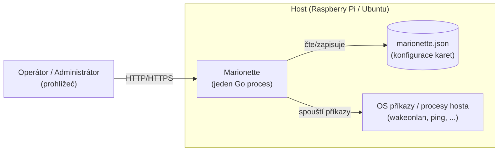

# Architektura — přehled

## Kontextový diagram

## Komponenty (dnešní stav + plánované)

| Komponenta             | Umístění          | Odpovědnost                                                     | Stav                                        |
| ---------------------- | ----------------- | --------------------------------------------------------------- | ------------------------------------------- |
| HTTP server / routing  | `internal/server` | API routy, SPA fallback                                         | Implementováno (CRUD, enqueue, status read) |
| Embed vestavěného UI   | `internal/webui`  | `go:embed` `web/dist`                                           | Implementováno                              |
| SPA (Vue 3 + PrimeVue) | `web/src`         | Dashboard, detail a editor karet; sdílený SSE stream s REST fallbackem (`composables/`), slovník stavů a formátování (`ui/`), sdílené komponenty (`components/`), PrimeVue preset (`theme/`) | Implementováno — fáze 5–8 (0029, 0032, 0033) |
| Config store           | `internal/config` | In-memory karty, Settings, JSON perzistence a historie (viz [Ochrana konfiguračního souboru](#ochrana-konfiguračního-souboru)) | Implementováno — fáze 2                     |
| Execution engine       | `internal/execengine` | Bezpečné spouštění akcí na hostu (procesní skupina, timeout, minimální prostředí), capture výstupu, limit souběžnosti | Implementováno — fáze 3, zpevněno 0024/0034 |
| Status/health engine   | `internal/status` | Vyhodnocení stavu karty, transition historie, volitelný polling | Implementováno — fáze 4                     |
| Fronta akcí            | `internal/actions` | Asynchronní běh přijatých akcí, omezená fronta, deduplikace, drain při shutdownu (FR-18, FR-35) | Implementováno — 0027, vyčleněno 0034      |
| Broker událostí        | `internal/events` | Fan-out změn statusu pro SSE, uzavření při shutdownu (ADR-0008)  | Implementováno — 0022, vyčleněno 0034      |
| REST API domény        | `internal/server` | CRUD karet/akcí, enqueue, čtení stavu, SSE zápis — čistě HTTP vrstva bez vlastních goroutin | Implementováno — fáze 5                     |

## Vztah k dokumentaci

- Požadavky, které komponenty naplňují: [../requirements/requirements.md](../requirements/requirements.md)
- Zdůvodnění klíčových rozhodnutí: [decisions/](decisions)
- Kdy a v jakém pořadí se komponenty staví: [../plans/roadmap.md](../plans/roadmap.md)

## Bezpečnostní poznámka

Execution engine spouští procesy na hostu na základě uživatelské konfigurace.
Návrh musí od začátku počítat s: absencí shell interpolace uživatelského
vstupu (spouštět přes `exec.Command(name, args...)`, ne přes shell string),
timeoutem pro každý běh, a omezením přístupu k UI/API (viz NFR-01). Spouštění
je popsáno v ADR-0005; ochrana API před cizími weby níže (NFR-12);
autentizace zůstává mimo MVP.

## Ochrana před cross-site požadavky

NFR-01 předpokládá důvěryhodnou síť, ne důvěryhodný prohlížeč: cizí webová
stránka otevřená operátorem by jinak mohla z jeho prohlížeče poslat
`POST /api/cards/{id}/actions/primary` (tzv. simple request bez preflightu)
nebo formulář `enctype=text/plain` na `POST /api/cards`. Proto middleware
`requireSameOrigin` v `internal/server` (blok 0026, NFR-12) chrání všechny
mutující API routy (`POST`, `PUT`, `PATCH`, `DELETE` pod `/api/`) v tomto
pořadí:

1. požadavek s tělem nebo s hlavičkou `Content-Type` musí deklarovat
   `application/json` (jinak `415`) — HTML formulář tento typ nedokáže
   poslat;
2. `Sec-Fetch-Site: cross-site` → `403`;
3. je-li přítomna hlavička `Origin`, její host se musí shodovat s `Host`
   požadavku, jinak `403`; `Origin: null` je odmítnut; požadavek bez
   `Origin` i bez `Sec-Fetch-Site` projde, aby fungovali non-browser klienti
   (`curl`);
4. je-li nastaven `MARIONETTE_ALLOWED_HOSTS` (čárkou oddělený seznam hostů,
   volitelně s portem), musí být `Host` v seznamu, jinak `403`; prázdná
   proměnná (výchozí) kontrolu vypíná.

Hosty v krocích 3 a 4 se porovnávají kanonicky (`canonicalHost`): bez ohledu
na velikost písmen a výchozí porty `80`, `443` a chybějící port jsou
rovnocenné, jiný explicitní port se musí shodovat přesně. Server totiž
nezná schéma spolehlivě — za TLS-terminující proxy prohlížeč posílá
`Origin: https://pi.local`, zatímco služba dostane `Host: pi.local` po
plain HTTP; obě hodnoty jsou operátorův host. Jiná služba na stejném
hostname s vlastním portem (`pi.local:9000`) zůstává cizím originem
(blok 0036).

Read-only routy, `GET /api/events` (SSE) a SPA fallback zůstávají bez
omezení. Chyby mají stejnou JSON obálku `{"error": "..."}` jako ostatní
odpovědi API. SPA proto posílá `Content-Type: application/json` u všech
mutujících volání včetně těch bez těla. Žádné CORS hlavičky se nevydávají
(jiné originy se záměrně nepovolují).

## Ochrana konfiguračního souboru

Konfigurace (`MARIONETTE_CONFIG`, FR-30..FR-35) se při startu načítá takto
(blok 0025):

- **soubor neexistuje** — aplikace startuje s prázdnou konfigurací a soubor
  vytvoří při první změně;
- **soubor je poškozený** (neplatný JSON, neplatná nastavení nebo karta,
  duplicitní ID) — soubor se před jakýmkoli zápisem přejmenuje na
  `<cesta>.corrupt-<UTC čas>` (při kolizi s číselným sufixem), do logu se
  zapíše varování s novou cestou a aplikace startuje s prázdnou konfigurací;
  původní obsah tak nikdy nepřepíše; pokud přejmenování selže, aplikace
  odmítne nastartovat;
- **soubor nelze přečíst** (např. oprávnění) — aplikace startuje s prázdnou
  konfigurací v režimu jen pro čtení: každá změna přes API vrátí 500 a v paměti
  se vrátí zpět, dokud operátor soubor nezpřístupní a službu nerestartuje;
- **neplatný runtime stav** (status, historie) uvnitř jinak platného souboru se
  ignoruje s varováním (FR-35), soubor se nepovažuje za poškozený.

Každá persistovaná mutace store (vytvoření, úprava, smazání karty, nastavení)
je atomická vůči paměti: pokud zápis na disk selže, změna se v paměti vrátí
zpět a API vrátí 500, takže stav v paměti vždy odpovídá poslednímu úspěšně
uloženému souboru. Zápis probíhá do `<cesta>.tmp` s `fsync`, přejmenováním
přes cílový soubor a `fsync` adresáře; existující soubor si zachová práva,
nový vzniká s `0600`.

## Řízené ukončení (shutdown)

Po přijetí `SIGINT`/`SIGTERM` proběhne v `cmd/marionette` (funkce
`shutdown`, blok 0027) pevně daná sekvence s celkovým limitem
`MARIONETTE_SHUTDOWN_TIMEOUT` (výchozí 20 s, musí být menší než systemd
`TimeoutStopSec`); každý krok se zaloguje s dobou trvání:

1. **Zastavení HTTP** — `http.Server.Shutdown` zavře listener a přes
   `RegisterOnShutdown` uzavře `StatusEventBroker`, takže všechny SSE streamy
   (`/api/events`) skončí okamžitě a shutdown na ně nečeká. Rozpracované
   běžné požadavky doběhnou.
2. **Uložení historie (první průchod)** — konfigurace, historie běhů a
   status projekce se uloží hned, dříve než by čekání na akce mohlo narazit
   na limit (FR-35). V režimu jen pro čtení (nečitelný soubor, viz výše) se
   krok přeskočí, aby se původní soubor nepřepsal.
3. **Uzavření fronty akcí** — čekající joby se zahodí (počet se zaloguje),
   běžící mohou doběhnout do zbytku limitu minus rezerva 3 s; poté se jejich
   kontext zruší a execution engine procesy ukončí (blok 0024).
4. **Zastavení scheduleru** — zruší probíhající kontroly a počká na workery.
5. **Uložení historie (druhý průchod)** — jen pokud se od prvního průchodu
   stav změnil (`Store.Dirty`), typicky doběhlá nebo zrušená akce.

Druhý signál během shutdownu proces ukončí okamžitě (výchozí obsluha
signálu se po zahájení shutdownu obnoví).

Fronta akcí (`BackgroundActions`) je omezená na `4 × MaxConcurrentActions`
(FR-18): plná fronta vrací `503` s hlavičkou `Retry-After` (odhad
z délky fronty na jednoho workera, min. 1 s), požadavek na kartu a druh
akce, které už ve frontě čekají, se nezařadí znovu a API vrátí `202`
idempotentně; deduplikace platí jen pro čekající joby, běžící job nový
požadavek neblokuje. Po zahájení shutdownu fronta vrací `503` s
`Retry-After: 1`.

## API kontrakt — chybové odpovědi a limity hodnot

Každá chybová odpověď na `/api/*` má JSON obálku `{"error": "…"}`
(blok 0028); žádná odpověď API není `text/plain`. Stavové kódy:

| Kód | Kdy                                                                                                     |
| --- | ------------------------------------------------------------------------------------------------------- |
| 400 | tělo není přesně jedna JSON hodnota očekávaného tvaru; zpráva uvádí pole nebo offset, ne interní typy   |
| 403 | cross-site požadavek nebo nepovolený `Host` (NFR-12)                                                    |
| 404 | neznámá karta nebo neznámá cesta pod `/api/`                                                            |
| 405 | známá cesta, nepodporovaná metoda; hlavička `Allow` vyjmenovává povolené metody                         |
| 409 | karta se stejným ID už existuje                                                                         |
| 413 | tělo přesahuje 1 MiB                                                                                    |
| 415 | mutující požadavek bez `Content-Type: application/json` (NFR-12)                                        |
| 422 | validace selhala; obálka má navíc `"fields": {"<json cesta>": "<důvod>"}` se všemi chybami najednou     |
| 503 | fronta akcí je plná nebo probíhá shutdown; hlavička `Retry-After` (FR-18)                                |
| 500 | persistence selhala (změna vrácena zpět) nebo jiná vnitřní chyba                                        |

`GET /api/health` vrací `{"status":"ok","version":"<git describe>","uptimeSec":n}`;
verze se vkládá při buildu (`-ldflags -X main.version`, `make build`).

Tvar stavových dat: `StatusSnapshot` karty, která ještě nebyla kontrolována,
je jen `{"state":"unknown"}` — `checkedAt` a `lastCheck` se vynechávají
(`StatusSnapshot.MarshalJSON`, blok 0032), klient tedy nerozpoznává nulový
čas Go. Pole `duration` u běhů a přechodů stavu je v **nanosekundách**
(Go `time.Duration`); frontend je převádí při zobrazení.

Limity hodnot karty (konstanty `config.Max*`, ADR-0004 „Limity hodnot“):

| Pole                                  | Limit                                                              |
| ------------------------------------- | ------------------------------------------------------------------ |
| `id`                                  | `^[A-Za-z0-9_-]{1,64}$`; serverem generovaná ID (`card-<32 hex>`) vyhovují |
| `name`                                | 1–120 znaků                                                        |
| `description`                         | ≤ 2000 znaků                                                       |
| `icon`                                | prázdné nebo `pi pi-<název>` (malá písmena, číslice, `-`), ≤ 64 znaků |
| `*.command`                           | 1–512 znaků                                                        |
| `*.args`                              | ≤ 64 položek, každá ≤ 1024 znaků                                   |
| `*.dir`                               | ≤ 1024 znaků                                                       |
| `*.env`                               | ≤ 64 položek; klíč `^[A-Za-z_][A-Za-z0-9_]*$` ≤ 128, hodnota ≤ 4096 |
| `*.timeoutSec`                        | 1–3600 (`MaxTimeoutSec`)                                           |
| `*.rule`                              | typ `exit_code`, `match`, `not_match`; `pattern` platný regex      |
| `pollingIntervalSeconds` a rychlé     | ≥ 0; rychlý interval < standardní interval                         |

Statické soubory SPA: `index.html` a klientské cesty se vydávají s
`Cache-Control: no-cache`, hashované soubory pod `/assets/` s
`public, max-age=31536000, immutable`; adresáře se nevypisují (vrací se
`index.html`).

## Kompozice a logování

`cmd/marionette` je jediné místo, kde se služby skládají (blok 0034):
`config.LoadFile` → `events.Broker` (`store.OnStatusChange = broker.Publish`)
→ `execengine.Runner` → `status.StatusCheckService` a `status.Scheduler` →
`actions.Queue` → `server.NewRouter(server.Dependencies{…})`. Router
předaný store nemutuje a `internal/server` nedrží žádné goroutiny mimo
HTTP handlery; rozhraní (`ActionQueue`, `EventSource`, …) definuje
konzument.

Logování používá `log/slog` bez globálního stavu: logger vzniká v `main`
podle `MARIONETTE_LOG_FORMAT` (`text` pro journald, `json`) a
`MARIONETTE_LOG_LEVEL` a předává se explicitně (`Dependencies.Logger`,
`actions.New`, `config.LoadFile`). Záznamy o akcích nesou atributy `card`,
`action`, `outcome`, `duration`; kroky shutdownu `step` a `duration`.
