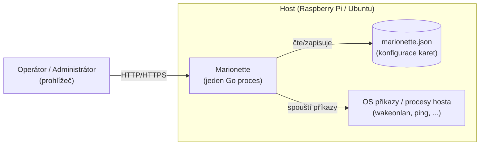

# Architektura — přehled

## Kontextový diagram

## Komponenty (dnešní stav + plánované)

| Komponenta             | Umístění          | Odpovědnost                                                     | Stav                                        |
| ---------------------- | ----------------- | --------------------------------------------------------------- | ------------------------------------------- |
| HTTP server / routing  | `internal/server` | API routy, SPA fallback                                         | Implementováno (CRUD, enqueue, status read) |
| Embed vestavěného UI   | `internal/webui`  | `go:embed` `web/dist`                                           | Implementováno                              |
| SPA (Vue 3 + PrimeVue) | `web/src`         | Dashboard, správa karet                                         | Implementován skelet (health check demo)    |
| Config store           | `internal/config` | In-memory karty, Settings, JSON perzistence a historie          | Implementováno — fáze 2                     |
| Execution engine       | `internal/exec`   | Bezpečné spouštění akcí na hostu, capture výstupu               | Implementováno — fáze 3                     |
| Status/health engine   | `internal/status` | Vyhodnocení stavu karty, transition historie, volitelný polling | Implementováno — fáze 4                     |
| REST API domény        | `internal/server` | CRUD karet/akcí, async enqueue, čtení stavu                     | Implementováno — fáze 5                     |

## Vztah k dokumentaci

- Požadavky, které komponenty naplňují: [../requirements/requirements.md](../requirements/requirements.md)
- Zdůvodnění klíčových rozhodnutí: [decisions/](decisions)
- Kdy a v jakém pořadí se komponenty staví: [../plans/roadmap.md](../plans/roadmap.md)

## Bezpečnostní poznámka

Execution engine spouští procesy na hostu na základě uživatelské konfigurace.
Návrh musí od začátku počítat s: absencí shell interpolace uživatelského
vstupu (spouštět přes `exec.Command(name, args...)`, ne přes shell string),
timeoutem pro každý běh, a omezením přístupu k UI/API (viz NFR-01 a otevřené
otázky v requirements.md). Toto se doladí samostatným ADR před implementací
fáze 3.
