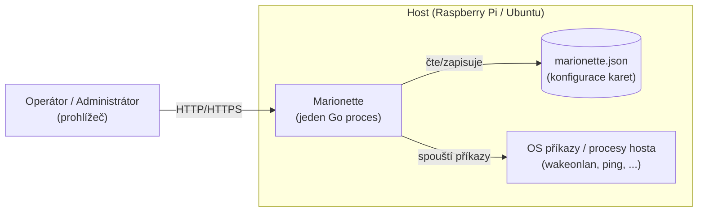

# Architektura — přehled

## Kontextový diagram

## Komponenty (dnešní stav + plánované)

| Komponenta             | Umístění          | Odpovědnost                                                     | Stav                                        |
| ---------------------- | ----------------- | --------------------------------------------------------------- | ------------------------------------------- |
| HTTP server / routing  | `internal/server` | API routy, SPA fallback                                         | Implementováno (CRUD, enqueue, status read) |
| Embed vestavěného UI   | `internal/webui`  | `go:embed` `web/dist`                                           | Implementováno                              |
| SPA (Vue 3 + PrimeVue) | `web/src`         | Dashboard, správa karet                                         | Implementován skelet (health check demo)    |
| Config store           | `internal/config` | In-memory karty, Settings, JSON perzistence a historie (viz [Ochrana konfiguračního souboru](#ochrana-konfiguračního-souboru)) | Implementováno — fáze 2                     |
| Execution engine       | `internal/exec`   | Bezpečné spouštění akcí na hostu, capture výstupu               | Implementováno — fáze 3                     |
| Status/health engine   | `internal/status` | Vyhodnocení stavu karty, transition historie, volitelný polling | Implementováno — fáze 4                     |
| REST API domény        | `internal/server` | CRUD karet/akcí, async enqueue, čtení stavu                     | Implementováno — fáze 5                     |

## Vztah k dokumentaci

- Požadavky, které komponenty naplňují: [../requirements/requirements.md](../requirements/requirements.md)
- Zdůvodnění klíčových rozhodnutí: [decisions/](decisions)
- Kdy a v jakém pořadí se komponenty staví: [../plans/roadmap.md](../plans/roadmap.md)

## Bezpečnostní poznámka

Execution engine spouští procesy na hostu na základě uživatelské konfigurace.
Návrh musí od začátku počítat s: absencí shell interpolace uživatelského
vstupu (spouštět přes `exec.Command(name, args...)`, ne přes shell string),
timeoutem pro každý běh, a omezením přístupu k UI/API (viz NFR-01 a otevřené
otázky v requirements.md). Toto se doladí samostatným ADR před implementací
fáze 3.

## Ochrana konfiguračního souboru

Konfigurace (`MARIONETTE_CONFIG`, FR-30..FR-35) se při startu načítá takto
(blok 0025):

- **soubor neexistuje** — aplikace startuje s prázdnou konfigurací a soubor
  vytvoří při první změně;
- **soubor je poškozený** (neplatný JSON, neplatná nastavení nebo karta,
  duplicitní ID) — soubor se před jakýmkoli zápisem přejmenuje na
  `<cesta>.corrupt-<UTC čas>` (při kolizi s číselným sufixem), do logu se
  zapíše varování s novou cestou a aplikace startuje s prázdnou konfigurací;
  původní obsah tak nikdy nepřepíše; pokud přejmenování selže, aplikace
  odmítne nastartovat;
- **soubor nelze přečíst** (např. oprávnění) — aplikace startuje s prázdnou
  konfigurací v režimu jen pro čtení: každá změna přes API vrátí 500 a v paměti
  se vrátí zpět, dokud operátor soubor nezpřístupní a službu nerestartuje;
- **neplatný runtime stav** (status, historie) uvnitř jinak platného souboru se
  ignoruje s varováním (FR-35), soubor se nepovažuje za poškozený.

Každá persistovaná mutace store (vytvoření, úprava, smazání karty, nastavení)
je atomická vůči paměti: pokud zápis na disk selže, změna se v paměti vrátí
zpět a API vrátí 500, takže stav v paměti vždy odpovídá poslednímu úspěšně
uloženému souboru. Zápis probíhá do `<cesta>.tmp` s `fsync`, přejmenováním
přes cílový soubor a `fsync` adresáře; existující soubor si zachová práva,
nový vzniká s `0600`.

## Řízené ukončení (shutdown)

Po přijetí `SIGINT`/`SIGTERM` proběhne v `cmd/marionette` (funkce
`shutdown`, blok 0027) pevně daná sekvence s celkovým limitem
`MARIONETTE_SHUTDOWN_TIMEOUT` (výchozí 20 s, musí být menší než systemd
`TimeoutStopSec`); každý krok se zaloguje s dobou trvání:

1. **Zastavení HTTP** — `http.Server.Shutdown` zavře listener a přes
   `RegisterOnShutdown` uzavře `StatusEventBroker`, takže všechny SSE streamy
   (`/api/events`) skončí okamžitě a shutdown na ně nečeká. Rozpracované
   běžné požadavky doběhnou.
2. **Uložení historie (první průchod)** — konfigurace, historie běhů a
   status projekce se uloží hned, dříve než by čekání na akce mohlo narazit
   na limit (FR-35). V režimu jen pro čtení (nečitelný soubor, viz výše) se
   krok přeskočí, aby se původní soubor nepřepsal.
3. **Uzavření fronty akcí** — čekající joby se zahodí (počet se zaloguje),
   běžící mohou doběhnout do zbytku limitu minus rezerva 3 s; poté se jejich
   kontext zruší a execution engine procesy ukončí (blok 0024).
4. **Zastavení scheduleru** — zruší probíhající kontroly a počká na workery.
5. **Uložení historie (druhý průchod)** — jen pokud se od prvního průchodu
   stav změnil (`Store.Dirty`), typicky doběhlá nebo zrušená akce.

Druhý signál během shutdownu proces ukončí okamžitě (výchozí obsluha
signálu se po zahájení shutdownu obnoví).

Fronta akcí (`BackgroundActions`) je omezená na `4 × MaxConcurrentActions`
(FR-18): plná fronta vrací `503` s hlavičkou `Retry-After` (odhad
z délky fronty na jednoho workera, min. 1 s), požadavek na kartu a druh
akce, které už ve frontě čekají, se nezařadí znovu a API vrátí `202`
idempotentně; deduplikace platí jen pro čekající joby, běžící job nový
požadavek neblokuje. Po zahájení shutdownu fronta vrací `503` s
`Retry-After: 1`.
