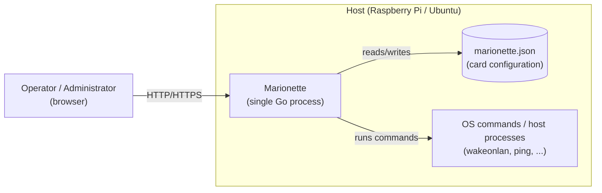

# Architecture — overview

## Context diagram

## Components (current state + planned)

| Component              | Location          | Responsibility                                                  | Status                                      |
| ---------------------- | ----------------- | --------------------------------------------------------------- | ------------------------------------------- |
| HTTP server / routing  | `internal/server` | API routes, SPA fallback                                        | Implemented (CRUD, enqueue, status read)    |
| Embedded UI            | `internal/webui`  | `go:embed` `web/dist`                                           | Implemented                                 |
| SPA (Vue 3 + PrimeVue) | `web/src`         | Dashboard, card detail and card editor; shared SSE stream with REST fallback (`composables/`), status vocabulary and formatting (`ui/`), shared components (`components/`), PrimeVue preset (`theme/`) | Implemented — phases 5–8 (0029, 0032, 0033) |
| Config store           | `internal/config` | In-memory cards, Settings, JSON persistence and history (see [Protecting the configuration file](#protecting-the-configuration-file)) | Implemented — phase 2                       |
| Execution engine       | `internal/execengine` | Safe execution of actions on the host (process group, timeout, minimal environment), output capture, concurrency limit | Implemented — phase 3, hardened 0024/0034   |
| Status/health engine   | `internal/status` | Card status evaluation, transition history, optional polling    | Implemented — phase 4                       |
| Action queue           | `internal/actions` | Asynchronous execution of accepted actions, bounded queue, deduplication, drain on shutdown (FR-18, FR-35) | Implemented — 0027, extracted 0034         |
| Event broker           | `internal/events` | Fan-out of status changes and recorded runs for SSE, closing on shutdown (ADR-0008)  | Implemented — 0022, extracted 0034         |
| Domain REST API        | `internal/server` | Card/action CRUD, enqueue, status reads, SSE writing — a pure HTTP layer with no goroutines of its own | Implemented — phase 5                       |

## Relation to the documentation

- Requirements the components fulfill: [../requirements/requirements.md](../requirements/requirements.md)
- Rationale for key decisions: [decisions/](decisions)
- When and in what order the components are built: [../plans/roadmap.md](../plans/roadmap.md)

## Security note

The execution engine runs processes on the host based on user configuration.
The design must account from the start for: no shell interpolation of user
input (run via `exec.Command(name, args...)`, not via a shell string), a
timeout for every run, and restricted access to the UI/API (see NFR-01).
Execution is described in ADR-0005; protection of the API against foreign
websites below (NFR-12); access only from paired devices in the section
"Access from paired devices" (NFR-01, ADR-0011).

## Protection against cross-site requests

NFR-01 assumes a trusted network, not a trusted browser: a foreign web page
opened by the operator could otherwise send, from the operator's browser,
`POST /api/cards/{id}/actions/primary` (a so-called simple request without
a preflight) or an `enctype=text/plain` form to `POST /api/cards`. That is
why the `requireSameOrigin` middleware in `internal/server` (block 0026,
NFR-12) protects all mutating API routes (`POST`, `PUT`, `PATCH`, `DELETE`
under `/api/`) in this order:

1. a request with a body or with a `Content-Type` header must declare
   `application/json` (otherwise `415`) — an HTML form cannot send this
   type;
2. `Sec-Fetch-Site: cross-site` → `403`;
3. if an `Origin` header is present, its host must match the request's
   `Host`, otherwise `403`; `Origin: null` is rejected; a request with
   neither `Origin` nor `Sec-Fetch-Site` passes, so that non-browser
   clients (`curl`) work;
4. if `MARIONETTE_ALLOWED_HOSTS` is set (a comma-separated list of hosts,
   optionally with a port), `Host` must be in the list, otherwise `403`; an
   empty variable (the default) disables the check.

Hosts in steps 3 and 4 are compared canonically (`canonicalHost`):
case-insensitively, and the default ports `80`, `443` and a missing port
are equivalent; any other explicit port must match exactly. The server
cannot reliably know the scheme — behind a TLS-terminating proxy the
browser sends `Origin: https://pi.local`, while the service receives
`Host: pi.local` over plain HTTP; both values are the operator's host.
Another service on the same hostname with its own port (`pi.local:9000`)
remains a foreign origin (block 0036).

Read-only routes, `GET /api/events` (SSE) and the SPA fallback remain
unrestricted. Errors have the same JSON envelope `{"error": "..."}` as other
API responses. The SPA therefore sends `Content-Type: application/json` on
all mutating calls, including those without a body. No CORS headers are
issued (other origins are intentionally not allowed).

## Access from paired devices

The `internal/access` package (block 0043, FR-50..FR-56, NFR-13, ADR-0011)
keeps paired devices in `devices.json` (by default next to
`MARIONETTE_CONFIG`, permissions `0600`, written via
`fsutil.WriteFileAtomic`) and at most one pairing code in memory. The
`requireDevice` middleware in `internal/server` sits behind
`requireSameOrigin` (NFR-12) and, for every request under `/api/` except
`GET /api/health`, `GET /api/session` and `POST /api/pairing`, requires a
`marionette_device` cookie with a valid token, otherwise `401`
`{"error","code":"pairing_required"}`. The SPA files remain public.

| Endpoint                     | Description                                                                                 |
| ---------------------------- | ------------------------------------------------------------------------------------------- |
| `GET /api/session`           | `200 {device, expiryDays}`, or `401` with `bootstrap: true` when nothing is paired           |
| `POST /api/pairing`          | `{code, name}` → `201 {device}` + cookie; invalid code `400`, empty name `422`              |
| `POST /api/pairing/code`     | code for another device `201 {code, expiresAt}` (paired device only)                         |
| `GET /api/devices`           | list of `{id, name, pairedAt, lastSeenAt, current}` without the token hash                   |
| `DELETE /api/devices/{id}`   | `204`; for the device itself, clears the cookie (sign-out)                                    |
| `PATCH /api/devices/{id}`    | `{name}` → `200 {device}` (FR-57); invalid name `422` with `fields.name`, unknown `404`       |

- **Token**: 32 bytes from `crypto/rand` (base64url); only the SHA-256 hash
  is stored on disk; never in the log or in a response body. The cookie is
  `HttpOnly`, `SameSite=Strict`, `Path=/`, `Max-Age` = device validity,
  `Secure` according to `MARIONETTE_COOKIE_SECURE` (`auto` = TLS
  connection, `always`, `never`).
- **Validity**: `MARIONETTE_DEVICE_EXPIRY_DAYS` (default 60, 1–400).
  Last use is kept in memory; it is written to disk and the cookie is
  renewed at most once a day per device and on shutdown (the "save
  devices" step) — this spares the SD card. A device unused for longer
  than its validity is removed on the next request or load.
- **Code**: 8 characters of Crockford Base32 (normalization of letter
  case, hyphens and the characters I/L/O), 10 minutes, single-use,
  invalidated after 5 failures, a new code cancels the old one,
  constant-time comparison. With no paired device, the code is written to
  the log at startup and again on `GET /api/session` if none is valid — so
  the pairing screen can always find the current code in
  `journalctl -u marionette`.
- **Removal** takes effect for REST immediately; the SSE stream of a
  removed device ends at the next heartbeat (15 s).
- **Failure**: a corrupted `devices.json` is quarantined
  (`.corrupt-<time>`) and the service starts with no devices (a new code in
  the log); an unreadable file stops startup (access is never silently
  opened). Recovering lost access: delete `devices.json` and restart the
  service.
- `MARIONETTE_AUTH=off` disables authentication (development); startup logs
  it as a warning.

## Protecting the configuration file

The configuration (`MARIONETTE_CONFIG`, FR-30..FR-35) is loaded at startup
as follows (block 0025):

- **the file does not exist** — the application starts with an empty
  configuration and creates the file on the first change;
- **the file is corrupted** (invalid JSON, invalid settings, a card without
  ID/name/command, zero timeout, invalid output rule, negative polling,
  duplicate ID — i.e. a `ValidateEssential` failure) — before any write,
  the file is renamed to `<path>.corrupt-<UTC time>` (with a numeric suffix
  on collision), a warning with the new path is logged and the application
  starts with an empty configuration; the original content is thus never
  overwritten; if the rename fails, the application refuses to start;
- **a card violates only the current limits** (lengths, ID characters,
  icon class, `MaxTimeoutSec`, interval relation — full `Validate`) — the
  card is loaded as stored, with a `card violates current limits` warning;
  tightening a limit in a new version therefore never makes configuration
  disappear. Full validation applies at the API boundary (card
  creation/update), so the card gets fixed on its first edit; the engine
  and the scheduler work with `ValidateEssential` (block 0038);
- **the file cannot be read** (e.g. permissions) — the application starts
  with an empty configuration in read-only mode: every change via the API
  returns 500 and is rolled back in memory until the operator makes the file
  accessible and restarts the service;
- **invalid runtime state** (status, history) inside an otherwise valid file
  is ignored with a warning (FR-35); the file is not considered corrupted.

Every persisted store mutation (creating, updating, deleting a card,
settings) is atomic with respect to memory (`Store.mutate`, block 0038): if
the write to disk fails, the change is rolled back in memory and the API
returns 500, so the in-memory state always matches the last successfully
saved file. The write goes to a unique temporary file
`<name>.<random>.tmp` in the same directory (`os.CreateTemp`) with `fsync`,
a rename over the target file and an `fsync` of the directory; an existing
file keeps its permissions (explicit `chmod`), a new one is created with
`0600`. The unique name protects against two writers (a second instance on
the same file, a history save on shutdown concurrent with a mutation) —
the last `rename` wins with a complete file; the history save is also
serialized with mutations (`persistMu`). A failure of the directory
`fsync` only after a successful `rename` (`ErrDirectorySync`) is merely
logged as a warning: the file already contains the change, so it is not
rolled back in memory.

## Graceful shutdown

After receiving `SIGINT`/`SIGTERM`, `cmd/marionette` (function `shutdown`,
block 0027) runs a fixed sequence with an overall limit of
`MARIONETTE_SHUTDOWN_TIMEOUT` (default 20 s, must be less than systemd's
`TimeoutStopSec`); each step is logged with its duration:

1. **Stop HTTP** — `http.Server.Shutdown` closes the listener and, via
   `RegisterOnShutdown`, closes the `StatusEventBroker`, so all SSE streams
   (`/api/events`) end immediately and shutdown does not wait for them.
   In-flight regular requests complete.
2. **Save history (first pass)** — the configuration, run history and
   status projection are saved right away, before waiting for actions
   could hit the limit (FR-35). In read-only mode (unreadable file, see
   above) the step is skipped so the original file is not overwritten.
3. **Close the action queue** — pending jobs are discarded (the count is
   logged), running ones may finish within the remaining limit minus a 3 s
   reserve; after that their context is canceled and the execution engine
   terminates the processes (block 0024).
4. **Stop the scheduler** — cancels in-progress checks and waits for the
   workers.
5. **Save history (second pass)** — only if the state has changed since the
   first pass (`Store.Dirty`), typically a finished or canceled action.

A second signal during shutdown terminates the process immediately (the
default signal handling is restored once shutdown begins).

The action queue (`BackgroundActions`) is bounded to
`4 × MaxConcurrentActions` (FR-18): a full queue returns `503` with a
`Retry-After` header (estimated from the queue length per worker, min.
1 s); a request for a card and action kind that is already waiting in the
queue is not enqueued again and the API returns `202` idempotently;
deduplication applies only to pending jobs, a running job does not block a
new request. After shutdown begins, the queue returns `503` with
`Retry-After: 1`. The `202` body (`{"cardId","actionKind","status":"accepted",
"checkedAt"?}`) carries the time of the last known status check at the
moment of acceptance (read before enqueueing): the SPA uses it as the
baseline for waiting for "a check newer than the one before my action", so
a scheduled check completed during the request is not mistaken for the
result; for a card that has never been checked the field is absent (block
0039).

## API contract — error responses and value limits

Every error response on `/api/*` has the JSON envelope `{"error": "…"}`
(block 0028); no API response is `text/plain`. Status codes:

| Code | When                                                                                                    |
| --- | ------------------------------------------------------------------------------------------------------- |
| 400 | the body is not exactly one JSON value of the expected shape; the message states the field or offset, not internal types |
| 403 | cross-site request or disallowed `Host` (NFR-12)                                                        |
| 404 | unknown card or unknown path under `/api/`                                                              |
| 405 | known path, unsupported method; the `Allow` header lists the allowed methods                            |
| 409 | a card with the same ID already exists                                                                  |
| 413 | the body exceeds 1 MiB                                                                                  |
| 415 | mutating request without `Content-Type: application/json` (NFR-12)                                      |
| 422 | validation failed; the envelope additionally has `"fields": {"<json path>": "<reason>"}` with all errors at once |
| 503 | the action queue is full or shutdown is in progress; `Retry-After` header (FR-18)                       |
| 500 | persistence failed (change rolled back) or another internal error                                       |

`GET /api/health` returns `{"status":"ok","version":"<git describe>","uptimeSec":n}`;
the version is embedded at build time (`-ldflags -X main.version`, `make build`).

Shape of status data: the `StatusSnapshot` of a card that has not been
checked yet is just `{"state":"unknown"}` — `checkedAt` and `lastCheck` are
omitted (`StatusSnapshot.MarshalJSON`, block 0032), so the client does not
have to recognize Go's zero time. The `duration` field of runs and status
transitions is in **nanoseconds** (Go `time.Duration`); the frontend
converts it for display.

Events of the SSE stream `GET /api/events` (ADR-0008):

| Event            | When                                                   | `data`                                         |
| ---------------- | ------------------------------------------------------ | ---------------------------------------------- |
| `status.changed` | change in the card's interpreted status                | `{"cardId": "…", "snapshot": StatusSnapshot}`  |
| `run.recorded`   | a primary action run recorded in the history (FR-42a, block 0058) | `{"cardId": "…", "run": Run}`, `Run` as an item of `GET /api/cards/{id}/runs` |

Both events share one `id` sequence. A slow subscriber loses the oldest
events, so after reconnecting the client loads status and runs via REST.

Card value limits (constants `config.Max*`, ADR-0004 "Value limits"):

| Field                                 | Limit                                                              |
| ------------------------------------- | ------------------------------------------------------------------ |
| `id`                                  | `^[A-Za-z0-9_-]{1,64}$`; server-generated IDs (`card-<32 hex>`) comply |
| `name`                                | 1–120 characters                                                   |
| `description`                         | ≤ 2000 characters                                                  |
| `icon`                                | empty or `pi pi-<name>` (lowercase letters, digits, `-`), ≤ 64 characters |
| `color`                               | empty or `black`, `blue`, `teal`, `purple`, `pink`, `orange`, `yellow` (FR-10a) |
| `*.command`                           | 1–512 characters                                                   |
| `*.args`                              | ≤ 64 items, each ≤ 1024 characters                                 |
| `*.dir`                               | ≤ 1024 characters                                                  |
| `*.env`                               | ≤ 64 items; key `^[A-Za-z_][A-Za-z0-9_]*$` ≤ 128, value ≤ 4096     |
| `*.timeoutSec`                        | 1–3600 (`MaxTimeoutSec`)                                           |
| `*.rule`                              | type `exit_code`, `match`, `not_match`; `pattern` a valid regex    |
| `pollingIntervalSeconds` and fast     | ≥ 0; fast interval < standard interval                             |

SPA static files: `index.html` and client-side paths are served with
`Cache-Control: no-cache`, hashed files under `/assets/` with
`public, max-age=31536000, immutable`; directories are not listed
(`index.html` is returned).

## Composition and logging

`cmd/marionette` is the only place where services are composed (block
0034): `config.LoadFile` → `events.Broker`
(`store.OnStatusChange = broker.Publish`,
`store.OnRunAppended = broker.PublishRun`)
→ `execengine.Runner` → `status.StatusCheckService` and `status.Scheduler` →
`actions.Queue` → `server.NewRouter(server.Dependencies{…})`. The router
does not mutate the store it is given and `internal/server` holds no
goroutines outside HTTP handlers; interfaces (`ActionQueue`,
`EventSource`, …) are defined by the consumer.

Logging uses `log/slog` without global state: the logger is created in
`main` according to `MARIONETTE_LOG_FORMAT` (`text` for journald, `json`)
and `MARIONETTE_LOG_LEVEL` and is passed explicitly
(`Dependencies.Logger`, `actions.New`, `config.LoadFile`). Action records
carry the attributes `card`, `action`, `outcome`, `duration`; shutdown
steps carry `step` and `duration`.
